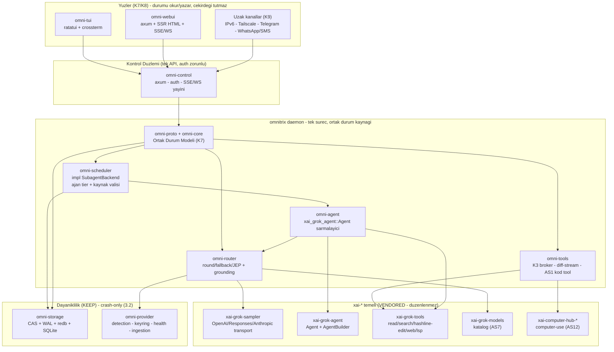

# MASTER-PLAN.md

## Omnitrix — Mimari Plan, Teknoloji Seçimleri, Veritabanı ve Geliştirme Yol Haritası

> **Bu belge nedir:** `ALPHA-PLAN.md`'de netleşen kararların (K1–K15) ve kanıt odaklı kod denetiminin (B1–B6) üzerine kurulan **mimari plandır**. Klasör yapısı, teknoloji seçimleri, çekirdek durum modeli, veritabanı şeması, tool sistemi tasarımı ve **her fazı çalıştırılabilir kabul kapısına bağlayan** geliştirme yol haritasını içerir.
>
> **Bu belge ne değildir:** Implementasyon kodu içermez. Trait/tip/metot isimleri **imza düzeyinde** referans verilir (ALPHA-PLAN talimat #4) ama Rust gövdesi yazılmaz. DDL/TOML şema taslakları referanstır, migration dosyası değildir.
>
> **Akış:** `ALPHA-PLAN.md` (kararlar) → **`MASTER-PLAN.md`** (bu belge, mimari) → implementasyon (fazlar).
>
> Tarih: 2026-07-26 · Depo: `/home/void0x14/Documents/omnitrix` · Branch: `masterplan` · Toolchain: Rust `1.92.0` · Hedef: `x86_64/aarch64-unknown-linux-gnu`

---

## Bu planın uyduğu sözleşme (ALPHA-PLAN Bölüm 10)

Her karar aşağıdaki 12 kurala bağlıdır; ihlal = plan hatası:

1. K1–K15 veri olarak alınır, tartışılmaz.
2. Her fazın sonunda **komut + çıktı + metrik + eşik** biçiminde kabul kapısı vardır. "Dikey dilim üretir" gibi ölçülemez ifade yasak.
3. Faz 0 çıktısı: **derlenen, `omnitrix --version` çalıştıran binary** (B1 tekrar etmez).
4. `xai-*` entegrasyonu **imza düzeyinde** belirtilir: hangi trait, hangi metot, hangi tip (B2 tekrar etmez).
5. Bölüm 2 kaderi (TUT / YENİDEN-YAZ / YOK-ET) + `ork-*`→`omni-*` yeniden adlandırma uygulanır.
6. **Sandbox yok** (K5). Yeni kodda `seccomp`/`bwrap`/`landlock`/sandbox referansı yasak.
7. Ortak çekirdek durum, iki UI'dan **önce** tanımlanır (K7/K8).
8. Bölüm 5 tool eksiklikleri çözüm zorunluluğudur; AS1 açık problem olarak işaretlidir.
9. Model isimleri/fiyatları **gömülmez** (AS7) — katalog güdümlü.
10. Bölüm 8 ilk dilim = Faz 1. Multiagent/JEP/persona/computer-use sonraki fazlar.
11. AS1–AS13 bu belgede çözülür, "sonra bakılır" bırakılmaz (Bölüm 18).
12. Anahtar besleme kapsam sınırı (6.3) korunur.

---

# BÖLÜM 1 — MİMARİ TEZİ VE KATMAN MODELİ

## 1.1 Kök sorunun (B2) mimari cevabı

ALPHA-PLAN'ın en kritik bulgusu: mevcut `ork-*` kodu, olgun `xai-*` altyapısını **kullanmak yerine ona paralel ikinci bir evren** kurmuştu (17 deklarasyon, 3 kullanım). MASTER-PLAN'ın merkezi kuralı bunu tersine çevirir:

> **Omnitrix = orkestrasyon katmanıdır. Tek-ajan çalışma zamanını, LLM taşımasını ve tool sistemini `xai-*` sağlar; omnitrix bunların üzerine çok-ajan planlama, yönlendirme, persona, sağlayıcı-besleme, uzak erişim ve dayanıklılık ekler.**

İki yönlü sınır (R2'yi kalıcı kapatır):

- **`omni-*` → `xai-*`'a bağımlıdır**, tam tersi değil. Her bağımlılık imza düzeyinde Bölüm 2'de sabittir.
- **`xai-*` düzenlenmez.** `xai-*` ağacı monorepo'dan senkronlanan (bkz. git log "Synced from monorepo", `SOURCE_REV`) **vendored** koddur. Omnitrix onu bir kütüphane gibi tüketir; fork etmez. Böylece upstream senkronu bozulmaz ve "genişletme" bahanesiyle sıfırdan yazma dürtüsü ortadan kalkar.

## 1.2 Katman diyagramı



**Okuma kuralı:** Yüzler asla çekirdek durumu tutmaz; kontrol düzleminden okur/yazar. Çekirdek tek süreçte yaşar. Dayanıklılık her yazımı WAL'a geçirir. `xai-*` en altta, salt-tüketilen temeldir.

## 1.3 İnvariantlar (her fazda geçerli)

| # | İnvariant | Kaynak | Zorlama noktası |
|---|---|---|---|
| I1 | Her faz kapısı = komut + metrik + eşik | 1.8, Talimat #2 | CI + `omni-bench` |
| I2 | `omni-*` → `xai-*` tek yön; `xai-*` düzenlenmez | B2, R2 | CI: `xai-*` diff = 0 |
| I3 | Tek ortak durum kaynağı; iki yüz ondan türer | K7, B5, R3 | `omni-proto` tek tanım |
| I4 | Sandbox yok; yetki tek noktada (tool broker) | K5, R5 | CI: yasak sembol taraması |
| I5 | Model ismi/fiyatı gömülü değil; katalogdan | AS7 | CI: literal model-adı taraması |
| I6 | Üretim yolunda `unwrap`/`expect`/`panic!` = 0 | Bölüm 4 | `clippy -D warnings` |
| I7 | Her yan etkili işlem önce WAL niyet kaydı | 3.2 | `write_journal` şeması |
| I8 | Her olgusal iddia kanıt referanslı | 3.4 | grounding kapısı |

---

# BÖLÜM 2 — `xai-*` ENTEGRASYON SÖZLEŞMESİ (imza düzeyinde, Talimat #4)

Bu tablo B2'nin panzehiridir: "genişletilir" yasak; her satır **hangi tip/trait/metodun** tüketildiğini sabitler. Faz planında (Bölüm 20) her faz yalnızca burada listelenen imzaları bağlayabilir.

| Omnitrix ihtiyacı | `xai-*` kaynağı | Tüketilen imza (tip · trait · metot) | Kullanan `omni-*` |
|---|---|---|---|
| LLM çağrısı (B3 boşluğu) | `xai-grok-sampler` | `SamplerActor::spawn(...) -> SamplerHandle`; `SamplerHandle::submit_and_collect(...)`, `::active_count()`, `::is_active(RequestId)`; L2: `stream_chat_completions` / `stream_responses` / `stream_messages` / `collect_response`; `SamplingEvent`, `doom_loop` | `omni-router`, `omni-agent` |
| Tek-ajan çalışma zamanı | `xai-grok-agent` | `struct Agent`; `AgentBuilder::from_definition(AgentDefinition)`, `.with_tools(Vec<String>)`, `.with_disallowed_tools(Vec<String>)`, `.with_permission_mode(PermissionMode)`, `.with_persona_instructions(..)`, `.with_compaction_policy(CompactionPolicy)`, `.with_memory_backend(..)`, `.with_fs(Arc<dyn AsyncFileSystem>)`, `.with_parent_scheduler_handle(..)`, `.with_state_path(PathBuf)`, `.build()` | `omni-agent` |
| Çok-ajan orkestrasyonu | `xai-grok-tools` (`.../grok_build/task/`) | `trait SubagentBackend { spawn(SubagentRequest)->SubagentResult; query(id,block,timeout)->SubagentSnapshot; cancel(id)->SubagentCancelOutcome; validate_type(..); describe_subagent_type(..) }`; `SubagentBackendResource(Arc<dyn SubagentBackend>)` | `omni-scheduler` **impl eder** |
| Tool sistemi + K3 seam | `xai-tool-runtime` + `xai-grok-tools` | `trait Tool { type Args: Deserialize+JsonSchema; type Output: ToolOutput; id()->ToolId; description(&ListToolsContext)->ToolDescription; capabilities()->ToolCapabilities; should_list(..) }`; `ToolDyn`, `ToolFamily`, `trait ToolDispatch`; `ToolBridge` (ToolRegistry+ToolState+SessionContext) | `omni-tools` |
| Edit sağlamlaştırma (5.3) | `xai-grok-tools` (`grok_build_hashline`) | `trait AnchorScheme { generate_anchors(&[&str])->Vec<Anchor>; validate(&ParsedAnchor,&[&str])->ValidationResult; find_shifted(&ParsedAnchor,&[&str],radius)->ShiftResult }` | `omni-tools` (edit) |
| Arama (5.4) | `xai-grok-tools` (`search_tool`) + `xai-tool-runtime` | `trait ToolSearchIndex`; `search_tool` implementasyonu | `omni-tools` (search) |
| Kod öğrenme temeli (AS1) | `xai-codebase-graph` | dahili indeks olarak; **çıktı formu omnitrix'e ait** (Bölüm 9.2) | `omni-tools` (learn) |
| Diff görünürlüğü (5.2) | `xai-hunk-tracker` + `xai-gix-status` | `xai_hunk_tracker` +/- hunk hesabı; `xai_gix_status::with_budgeted_thread_limit(..)`; **kancalama** `AgentBuilder::with_fs(Arc<dyn AsyncFileSystem>)` üstünden | `omni-tools` (fs-shim) |
| Model kataloğu (AS7) | `xai-grok-models` | `DEFAULT_MODELS_JSON`, `default_model()`, `default_web_search_model()`, `default_session_summary_model()` | `omni-router` |
| Bağlam durumu | `xai-chat-state` | `ChatStateHandle` (`ork-runtime` zaten kullanıyordu — B2 istisnası) | `omni-agent` |
| Bağlam sıkıştırma (3.1 uyku) | `xai-grok-compaction` + `xai-token-estimation` | compaction politikası + token tahmini | `omni-scheduler`, `omni-agent` |
| WAL (3.2) | `xai-sqlite-journal` | `JournalMode` (`ork-storage/wal.rs` zaten kullanıyor — B2 istisnası) | `omni-storage` |
| Geçici izolasyon branch'i (K5/AS5) | `xai-fast-worktree` | worktree oluştur/at | `omni-scheduler`, `omni-tools` |
| Dosya izleme (K13) | `xai-fsnotify` | harici SQLite değişim izleme | `omni-provider` (ingestion) |
| Sağlayıcı devre kesici (6.5) | `xai-circuit-breaker` | health'e bağlı devre kesme | `omni-router` |
| Interrupt/interjection (AS2) | `xai-interjection-core` + `SamplerHandle` iptal | mid-stream abort + `SubagentBackend::cancel` | `omni-scheduler` |
| Prompt kuyruğu (6.8 ajana yazma) | `xai-prompt-queue` | ajana çalışırken mesaj enjekte | `omni-scheduler`, `omni-control` |
| Computer-use (AS12) | `xai-computer-hub-core/sdk/mcp-adapter` | hub backend soyutlaması (Wayland+X11) | `omni-tools` |
| MCP istemcisi (K14 araştırma) | `xai-grok-mcp` | dış arama/crawl MCP'lerine bağlanma | `omni-research` |
| Config yükleme (AS8) | `xai-grok-config` + `xai-grok-config-types` | TOML katmanlı yükleme | `omni-config` |
| Sır/keyring (AS10) | `xai-grok-secrets` + `ork-provider/keyring.rs` | chacha20poly1305 + zeroize keyring | `omni-provider`, `omni-backup` |
| Gözlemlenebilirlik (AS9) | `xai-tracing` (+ `fastrace`) | span/trace; RAM'e göre örnekleme | tüm crate'ler |
| Kilitlenme yakalayıcı (AS5) | `xai-crash-handler` | panic/crash raporu | `omnitrix` bin |

**Doğrulama kapısı (I2):** Her faz sonunda `grep -R "use xai_"` sayımı ile deklare-edilen `xai-*` bağımlılıklarının **fiilen kullanıldığı** doğrulanır. Kullanılmayan `xai-*` bağımlılığı = derleme uyarısı = kapı kırmızı. Bu, "17 deklare 3 kullanım" (B2) tekrarını mekanik olarak imkânsızlaştırır.

---

# BÖLÜM 3 — CRATE HARİTASI VE YENİDEN ADLANDIRMA (K15, 2.4)

## 3.1 İsim şeması kararı

Tek `omnitrix` binary + **iç orkestrasyon crate'leri `omni-*`**. `xai-*` isimleri korunur (vendored). `ork-*` → `omni-*` mekanik geçiş **Faz 0'da** yapılır ki isim borcu birikmesin.

## 3.2 Crate kaderi ve isim eşlemesi

| Yeni crate | Eski karşılık | Kader (Bölüm 2 ALPHA) | Sorumluluk |
|---|---|---|---|
| `omni-proto` | — (yeni) | YENİ | Ortak durum modeli, olay tipleri, DTO'lar (K7 tek kaynak) |
| `omni-core` | `ork-runtime` bir kısmı | YENİDEN YAZ | Domain tipleri, ajan/görev durum makinesi, orkestrasyon çekirdeği |
| `omni-storage` | `ork-storage` | **TUT** (revize) | CAS, WAL, redb, SQLite, tek-writer aktör |
| `omni-provider` | `ork-provider` | **TUT** (revize) | `detection`, `keyring`, `health`, `ingestion` |
| `omni-scheduler` | `ork-runtime` | YENİDEN YAZ | `impl SubagentBackend`; ajan tier'ları; kaynak valisi (K1/K2) |
| `omni-agent` | — (yeni, ince) | YENİ | `xai_grok_agent::Agent` sarmalayıcı; persona→`AgentDefinition` |
| `omni-router` | `ork-router` | YENİDEN YAZ | round/fallback/JEP + grounding; **gerçek `SamplerHandle`'a bağlı** |
| `omni-tools` | — (yeni) | YENİ | K3 broker, diff-stream fs-shim, AS1 kod tool, edit/search kablolaması |
| `omni-config` | `ork-runtime` config'i | YENİ | Katmanlı config (AS8) |
| `omni-control` | `ork-webui` bir kısmı | YENİDEN YAZ | Kontrol düzlemi API'si; auth; SSE/WS yayını |
| `omni-tui` | `ork-tui` | YENİDEN YAZ | ratatui yüzü; **daemon'a bağlanır** |
| `omni-webui` | `ork-webui` | YENİDEN YAZ | SSR HTML + SSE/WS yüzü |
| `omni-notify` | `ork-notify` | **TUT** (genişlet) | Telegram/Twilio/... bildirim kanalları |
| `omni-research` | — (yeni) | YENİ | Sağlayıcı-değiştirilebilir araştırma motoru (K14) |
| `omni-backup` | `ork-backup` | YENİDEN YAZ (geç faz) | 3-2-1, doğru SigV4 + şifreleme |
| `omni-record` | `ork-record` | YENİDEN YAZ (geç faz) | Event-log + tetiklemeli medya kaydı (AS6) |
| `omnitrix` (bin) | `ork-daemon` (`orkd`) | YENİDEN YAZ | Lazy-init entrypoint; alt-komutlar |

## 3.3 YOK ET (2.3)

- `ork-record`, `ork-webui`, `ork-runtime` altındaki bağımsız `target/` dizinleri → workspace kirliliği, silinir.
- `ork-*` crate'lerinin elle yazılmış sürüm bağımlılıkları → `workspace = true`'ya çevrilir.
- `ork-backup` imzasız S3 PUT → silinir; `omni-backup`'ta doğru SigV4 ile yeniden (AS10).
- `agents.sandbox_profile` kolonu ve `ork-runtime`'daki sandbox varsayımları → silinir (K5/I4).

---

# BÖLÜM 4 — KLASÖR YAPISI

```
omnitrix/
├── Cargo.toml                      # workspace; resolver=2; omni-* + xai-* members
├── Cargo.lock
├── rust-toolchain.toml             # 1.92.0, x86_64 + aarch64 linux
├── clippy.toml · rustfmt.toml
├── MASTER-PLAN.md · ALPHA-PLAN.md
│
├── bin/                            # yardimci scriptler (mevcut)
├── config/
│   ├── omnitrix.toml               # kok config (varsayilanlar, AS8 dosya katmani)
│   ├── models.toml                 # AS7 katalog override (xai-grok-models ustune)
│   ├── routing.toml                # 6.5 rol->model + strateji (JEP config'te)
│   ├── profiles/                   # K2 kaynak profilleri (MEVCUT: high/mid/low.toml)
│   └── personas/                   # K12: her persona bir dosya, calisirken eklenebilir
│       ├── _schema.md              # persona sema referansi
│       ├── planner.toml
│       ├── executor.toml
│       └── ...                     # ~60 persona; kullanici doldurur
├── prompts/                        # rol sistem promptlari (MEVCUT: judge/planner/...)
│
├── migrations/                     # SQLite sema (MEVCUT 0001-0007, Bolum 14'te revize)
│   ├── 0001_providers.sql ...
│   └── 0008_omni_revisions.sql     # yeni: sandbox_profile drop, file_touches, tier...
│
├── crates/
│   ├── omni/                       # orkestrasyon (yeni ad)
│   │   ├── omni-proto/             # K7 ortak durum modeli
│   │   ├── omni-core/
│   │   ├── omni-storage/           # (ork-storage revize)
│   │   ├── omni-provider/          # (ork-provider revize)
│   │   ├── omni-scheduler/
│   │   ├── omni-agent/
│   │   ├── omni-router/
│   │   ├── omni-tools/
│   │   ├── omni-config/
│   │   ├── omni-control/
│   │   ├── omni-tui/
│   │   ├── omni-webui/
│   │   ├── omni-notify/
│   │   ├── omni-research/
│   │   ├── omni-backup/
│   │   ├── omni-record/
│   │   └── omnitrix/               # bin (orkd yerine)
│   ├── common/                     # xai-* (VENDORED - duzenlenmez)
│   ├── codegen/                    # xai-* (VENDORED - duzenlenmez)
│   └── build/
│
├── tests/                          # entegrasyon + chaos (MEVCUT: crash_recovery, multiagent_fanout, provider_fallback)
│   ├── crash_recovery.rs           # 3.2 kapisi
│   ├── multiagent_fanout.rs        # K1 kapisi
│   ├── provider_fallback.rs        # 6.5 kapisi
│   ├── grounding_redteam.rs        # 3.4 kapisi (yeni)
│   ├── tool_allowlist_redteam.rs   # K3 kapisi (yeni)
│   ├── ui_parity.rs                # K7 kapisi (yeni)
│   └── diff_visibility.rs          # 5.2 kapisi (yeni)
│
├── benches/                        # omni-bench: cold-start, shutdown, RSS (Bolum 4 metrikleri)
└── prod/ · third_party/ · LICENSE · THIRD-PARTY-NOTICES
```

**Ayrım kuralı:** `crates/omni/` yazılır ve düzenlenir; `crates/common/` + `crates/codegen/` (xai-*) salt okunur temeldir (I2). CI, `crates/common` ve `crates/codegen` altında diff tespit ederse kapıyı kırmızıya çevirir.

---

# BÖLÜM 5 — TEKNOLOJİ SEÇİMLERİ (gerekçeli)

| Alan | Seçim | Gerekçe / ALPHA bağı |
|---|---|---|
| Dil / toolchain | Rust `1.92.0` | Toolchain sabit; 80+ crate üretim kalitesi (1.1) |
| Async runtime | `tokio` (multi-thread) | `xai-*` her yerde tokio; aktör modeli sampler/storage'da mevcut |
| LLM taşıma | `xai-grok-sampler` | OpenAI ChatCompletions + Responses + Anthropic Messages **tek çatı**; çok-sağlayıcı doğuştan (6.4). B3 boşluğunu kapatır |
| Ajan çalışma zamanı | `xai-grok-agent` + `xai-grok-tools` | Kanıtlı tek-ajan döngüsü + tool ailesi; sıfırdan yazmak yasak (B2) |
| İlişkisel depo | SQLite (via `xai-sqlite-journal` WAL) | Sorgu + ilişki; WAL crash-only temeli (3.2); mevcut migrations |
| Blob / CAS | `redb` + içerik-adresli depo (`omni-storage/cas.rs`) | Bağlam/çıktı/medya blobları; DB yalnız `*_ref` tutar; dedup |
| TUI | `ratatui` + `crossterm` (+ `xai-ratatui-inline`, `xai-ratatui-textarea`) | B1 düzeltmesi: **bağımlılıklar deklare edilir**; immediate-mode |
| WebUI | `axum` + sunucu-taraflı HTML (`maud`/`askama`) + **SSE (birincil) / WebSocket (çift yön)** | K8: JS build zinciri yok; en hızlı cold-start; telefonda çalışır; push modeli ölçekte doğru. HTMX opsiyonel ilerlemeli zenginleştirme |
| Kontrol düzlemi | `axum` (WebUI ile ortak sunucu) | K9: tek control-plane; dört kanal istemcidir |
| Auth | Token (argon2 hash) + opsiyonel mTLS | K9: public IPv6 → **zorunlu** |
| Git | `gix` (gitoxide) via `xai-gix-status` / `xai-fast-worktree` | K5 geçici branch; 5.2 diff durum |
| Bellek ayırıcı | `jemalloc` (ölçümle doğrulanır) | 100+ ajan churn'ünde fragmentasyon kontrolü (ALPHA kaynakları); low-profile'da sistem ayırıcıya düşülebilir |
| Config | TOML + `serde` via `xai-grok-config` | AS8 katmanlı; git-dostu; persona dosyaları |
| Gözlemlenebilirlik | `tracing` + `fastrace` (+ opsiyonel Prometheus exporter) | AS9; RAM'e göre örnekleme; low-profile'da kapalı |
| Model kataloğu | `xai-grok-models` JSON + `config/models.toml` | AS7: isim gömülmez; katalogdan çözülür |
| Serileştirme (wire) | JSON (SSE/WS/DTO) + `postcard`/`bincode` (CAS-içi) | İnsan+AI okunur dış yüz; kompakt iç depo |

**Reddedilenler (gerekçeli):** Leptos/WASM (K8: build zinciri istenmiyor); harici computer-use crate'leri ilk elde (AS12: `xai-computer-hub-*` zaten var); sandbox/seccomp/bwrap (K5).

---

# BÖLÜM 6 — ÇEKİRDEK ORTAK DURUM MODELİ (K7/K8, iki UI'dan ÖNCE)

R3'ü (UI durumu bozulur) kapatan tek kaynak. `omni-proto` crate'i, **iki yüzün de türetildiği** kanonik tipleri tanımlar. UI'lar bu tipleri okur; kendi tipini icat edemez (B5 tekrarı yasak).

## 6.1 Kanonik tipler (imza taslağı, gövdesiz)

```
// omni-proto — tek kaynak
struct SystemSnapshot { agents: Vec<AgentView>, tasks: Vec<TaskView>,
                        providers: Vec<ProviderView>, resource: ResourceGauge, ts: Timestamp }
struct AgentView { id, persona, tier: AgentTier, task_id, parent_id,
                   state: AgentState, rss_kb, tokens_in, tokens_out, cost,
                   trust: f32, depth: u8, last_event_seq: u64 }
enum AgentTier { Existing, Sleeping, Queued, Active }        // 3.1
enum AgentState { Init, Planning, AwaitingModel, RunningTool, Interrupted, Blocked, Done, Failed }
struct FileTouch { agent_id, path, outside_workspace: bool, added: u32, removed: u32, pre_ref, post_ref, ts }
enum StateEvent { AgentUpserted(AgentView), TaskUpserted(TaskView),
                  FileTouched(FileTouch), ToolCall(ToolCallView),
                  Interrupt(InterruptView), Notice(NoticeView), ResourceTick(ResourceGauge) }
```

## 6.2 Okuma/yazma sözleşmesi

- **Okuma:** UI, `omni-control`'den `SystemSnapshot` (ilk yükleme) + `StateEvent` akışı (SSE/WS) alır. TUI ve WebUI **aynı** akışı tüketir; yalnızca **render** farklıdır (K7: "çekirdek tek, yüzler iki").
- **Yazma:** UI komutları (`Command` enum: `SpawnTask`, `WriteToAgent`, `Interrupt`, `Approve`, `SetRouting`, ...) `omni-control`'e gider; çekirdek uygular; sonuç `StateEvent` olarak **her iki UI'a** yayılır. Böylece birinden yapılan değişiklik diğerinde görünür (Bölüm 4 parite kriteri).
- **Tek yazar:** durum mutasyonları `omni-core` üstünden tek noktadan geçer; `omni-storage` writer-actor'e WAL yazar (I7).

**Kabul kapısı (K7):** `tests/ui_parity.rs` — TUI komutu gönderir, WebUI akışında aynı `StateEvent` görünür; snapshot'lar bit-eş.

---

# BÖLÜM 7 — AJAN YAŞAM DÖNGÜSÜ VE KAYNAK YÖNETİMİ (K1, K2, 3.1)

## 7.1 Tier modeli (aktif ≠ var-olan)

ALPHA 3.1 kuralı: "10.000 aktif" değil, "10.000 **var-olan**, N **aktif** (N dinamik)". Tier geçişleri `omni-scheduler`'da:

| Tier | RAM ayak izi | Depo | Geçiş tetikleyici |
|---|---|---|---|
| `Existing` | ~0 (yalnız DB satırı) | SQLite `agents` | oluşturuldu, hiç ısınmadı |
| `Sleeping` | ~200 byte metadata | bağlam CAS'ta (`context_ref`) | idle timeout veya bellek baskısı → `xai-grok-compaction` ile sıkıştır, diske al |
| `Queued` | metadata + hafif bağlam | RAM (hazır) | çalışmaya hazır, slot bekliyor |
| `Active` | ~200KB bağlam + ~30-60MB soket/TLS | RAM, in-flight | valinin verdiği slot açık |

## 7.2 Kaynak valisi (K2 "iş kutsal")

`omni-scheduler` içinde bir **admission controller**: aktif slot sayısı N, donanım kaynağına göre **dinamik** (K1). Kod N'i tavanlamaz; RAM/CPU/FD basıncını `xai-system-power` + RSS ölçümüyle okur.

- Basınç düşük → daha çok `Queued`'ı `Active`'e al.
- Basınç yüksek → yeni `Active` alımını durdur, en uzun-idle `Active`'i `Sleeping`'e sıkıştır (**iş kaybı yok**: bağlam CAS'a, WAL'a niyet). Kuyruk büyür ama görev **yarıda kesilmez** (K2).
- **Asla:** çalışan bir görevi düşürmek. Swap-out ve kuyruklama tek çözüm; iş tamamlanana kadar kayıtlı kalır.

**Kabul kapısı (K2 "iş kutsal"):** Kaynak-kısıtlı görev testi — bellek 100 ajana yetmeyecek şekilde sınırlanır; tüm görevler yine de tamamlanır (swap-out/kuyruk devreye girer), hiçbiri düşmez.
**Kabul kapısı (K1):** `tests/multiagent_fanout.rs` — 100 `Active` ajan gerçek LLM çağrısı yaparken sistem stabil; RSS ölçülür ve raporlanır (< eşik, profile bağlı).

## 7.3 Rekürsiyon ve fan-out (AS3)

`omni-scheduler` spawn anında zorlar:
- **Derinlik tavanı:** varsayılan `5` (`config: scheduler.max_depth`). `agents.depth` kolonundan okunur; aşıldı → spawn reddi + `Notice`.
- **Seviye başına fan-out tavanı:** varsayılan `8` (`scheduler.max_fanout`).
- **Global aktif tavanı:** kaynak valisi (7.2), sabit değil.

## 7.4 Bütçe kalıtımı (AS4)

Hiyerarşik muhasebe:
- Ebeveyn, çocuğa bir **bütçe zarfı** tahsis eder (token/cost). Çocuğun harcaması **ebeveynin kalanından düşer** (`tasks.budget_allocated`, `tasks.budget_spent`).
- Kök bütçe: **tam-otonom** modda `∞` (K11); **kullanıcı-odaklı** modda sonlu.
- "İş bitti" tespiti (7.5) harcamayı durdurur — bitmiş işe kaynak yakmak yasak (K11/R6).

## 7.5 Sonlanma oracle'ı (K10, R6)

Görev **ancak** şu üçü sağlanınca `Done`:
1. **Otomatik doğrulama geçer:** build + test + şema/lint (faz kapısı komutları).
2. **Yanlışlamacı yargıç onayı** (3.4): kanıt-referanslı iddialar, çürütülemedi.
3. **Kullanıcı onayı** (hibrit karar, K10).

"İş bitti" sinyali gelince scheduler görevi `Done`'a alır, alt-ajanları toplar, bütçe tüketimini keser. Bu, "sonsuz iterasyon ama bitince dur" (K11) çelişkisini çözer.

---

# BÖLÜM 8 — DAYANIKLILIK: CRASH-ONLY (3.2)

## 8.1 Tek kod yolu

Normal kapanış ile SIGKILL **aynı** olmalı (3.2). Yol:
1. Her yan etkili işlem, yapılmadan **önce** `write_journal`'a idempotent niyet kaydı yazar (`op_id` UNIQUE, `applied=0`) — I7.
2. İşlem yapılır; başarıyla → `applied=1`.
3. Ctrl+C/SIGKILL → **flush yok, bekleme yok**, süreç ölür. Kapanış **O(1)**, veri hacminden bağımsız.
4. Açılışta `applied=0` niyetleri **replay** edilir (idempotent olduğu için tekrar güvenli).

`omni-storage` (TUT): `cas.rs` (içerik-adresli, immutable), `wal.rs` (`xai-sqlite-journal::JournalMode`), `writer_actor.rs` (tek yazar → sıralı, yarış yok), `redb_store.rs`, `sqlite_schema.rs`.

**Kabul kapısı (anlık kapanma):** SIGINT→exit < 50ms, 100GB aktif yazma altında bile (veri hacminden bağımsız) — `omni-bench`.
**Kabul kapısı (veri kaybı yok):** `tests/crash_recovery.rs` — chaos: rastgele `kill -9` + restart; her taahhüt işlem ya tam ya replay; hiçbiri yarım değil.

## 8.2 Cold-start (3.3, lazy-init)

İlk TUI frame'i **hiçbir** provider'a bağlanmadan, hiçbir ajan yüklemeden çizilir; ağ/storage/provider arka planda ısınır. `ork-daemon`'ın tersi (her şey TUI'den önce) düzeltilir.

**Kabul kapısı (cold-start):** exec→ilk TUI frame < 100ms (sıcak cache), < 400ms (soğuk) — binary-içi timestamp + `hyperfine`.

## 8.3 Panic izolasyonu (AS5, sandbox yok)

- Tool yürütmeleri, per-ajan supervisor task'ında `catch_unwind` ardında koşar. Bir tool paniklerse **o tool çağrısı** başarısız olur (kayıt: `tool_calls.status='panicked'`), süreç düşmez. Bunun için daemon profili `panic="unwind"` kullanır (workspace'te bu profil mevcut — Cargo.toml'da hem `abort` hem `unwind` profilleri var).
- Gerçekten tehlikeli native işlemler (computer-use, geniş FS yazımı) için **K5 geçici git branch** (`xai-fast-worktree`) izolasyon+geri-alma sınırıdır — sandbox değil. Hata → branch atılır, ana ağaç bozulmaz.
- `xai-crash-handler` süreç düzeyi panic'te tanılama raporu yazar.

---

# BÖLÜM 9 — TOOL SİSTEMİ (Bölüm 5 ALPHA — çözüm zorunluluğu)

Tüm tool'lar `xai-tool-runtime::Tool` trait'ini (Bölüm 2) implemente eder veya `xai-grok-tools`'tan gelir. Omnitrix'in kattığı: **broker (K3)**, **diff-stream (5.2)**, **kod-öğrenme (AS1)**, ve edit/search kablolaması.

## 9.1 Yetki broker'ı (K3, I4 — tek zorlama noktası)

Model katmanında token engelleme imkânsız (3.5); zorlama **tool katmanında**:
- Her persona bir **tool allowlist** taşır (Bölüm 11). `AgentBuilder::with_tools` + `with_disallowed_tools` ile ajanın gördüğü tool kümesi filtrelenir. Expose edilmeyen tool = model ne üretirse üretsin çalışmaz.
- **Shell allowlist:** `omni-tools` bir shell komut parser'ı çalıştırır; yalnız izinli ikili (`cargo`, `git`, `npm`, `pytest`, ...) geçer; `grep`/`sed`/`cat`/`awk`/`eof`-hilesi **parse + policy** ile reddedilir → `capability_audit`'e loglanır.
- **Acil kaçış (K3):** native tool %99 çalışmazsa ajan gerekçe yazıp geçici serbest shell ister → `interrupts`+`capability_audit`'e düşer → **yargıç onaylar** → süreli izin. Her şey loglanır.

**Kabul kapısı (K3):** `tests/tool_allowlist_redteam.rs` — modele yasak araç/komut kullandırma seti; sızma = 0; her deneme reddedilir + loglanır.

## 9.2 Kod öğrenme tool'u (AS1 — AÇIK PROBLEM, yeni yaklaşım)

Kullanıcı **iki yolu da reddetti**: ham dosya okuma (context yakar) ve sembol grafiği/mimari özet (codebase-memory-mcp, tatmin etmedi). Yeni açı:

> **Soru-güdümlü kanıt getirme (retrieval), gezinme (browsing) değil.**

- **Girdi:** doğal-dil soru ("auth nerede zorlanıyor?", "bu hata hangi state'ten geliyor?").
- **Çıktı:** *sıralı kanıt paketi* — soruya cevap veren **minimal span'lar** (satır aralıkları), her span'ın yanında **tek satırlık "neden ilgili"** + devam kürsörü. Asla tüm dosya, asla tüm grafik.
- **Fark 1 (ham-okuma değil):** dosya değil, soruya göre kırpılmış span'lar döner; context yakmaz.
- **Fark 2 (graph/özet değil):** kalıcı, kullanıcının bakımını üstlendiği sembol grafiği **yok**. İndeks (`xai-codebase-graph`) dahili ve geçicidir; kullanıcıya asla grafik/özet olarak sunulmaz. Çıktı = göreve özel cevap + **hashline anchor'larına (5.3) atıf**, böylece Edit tool'u doğrudan tüketebilir (retrieval→edit zinciri kapanır).
- **Etkileşim:** iteratif — ajan daraltma sorusu sorar, kürsörle derinleşir; her adım küçük ve göreve bağlı.

Bu, R4'ü (yine tatmin etmez) hedefler: reddedilen iki yol **tekrarlanmaz**, üçüncü yol (soru→kanıt→anchor) denenir.

## 9.3 Diff görünürlüğü (5.2)

- **Kancalama:** `AgentBuilder::with_fs(Arc<dyn AsyncFileSystem>)` ile omnitrix, ajanın tüm dosya yazımlarını saran bir FS-shim enjekte eder. Kanca **FS trait düzeyinde** olduğu için **path-agnostik**: çalışma dizini içi/dışı fark etmez (sandbox yok → tüm FS dokunuşları görünür, K5+5.2).
- **Hesap:** her yazım öncesi/sonrası CAS'a (`pre_ref`/`post_ref`), +/- hunk `xai-hunk-tracker` ile, repo-durumu `xai-gix-status`. Sonuç `file_touches` tablosuna + `StateEvent::FileTouched` olarak global diff akışına.
- **Görünüm:** TUI/WebUI'da her ajanın dokunduğu dosyaların `+`/`-` grafiği (kayıp opencode özelliği geri gelir).

**Kabul kapısı (5.2):** `tests/diff_visibility.rs` — ajan çalışma dizini **dışına** yazar; dokunuş CLI/UI diff akışında görünür.

## 9.4 Edit tool (5.3 — patlamaz)

Kırılgan `old_string`/`new_string` yerine **hash-anchor'lı satır adresleme**: `grok_build_hashline::AnchorScheme`.
- `generate_anchors` her satıra hash anchor üretir; edit anchor'a hedeflenir.
- Dosya kaydıysa `find_shifted` **sınırlı pencerede** kaymış anchor'ı bulur (drift-tolerant) → `ShiftResult::Found/Ambiguous/NotFound`.
- Başarısızlıkta `validate` → `ValidationResult` **düzeltilebilir geri bildirim** verir (modele "şu anchor kaydı/belirsiz" der), sed'e kaçışa gerek kalmaz (zaten K3 kapalı).

## 9.5 Arama tool (5.4)

`xai-grok-tools::search_tool` + `ToolSearchIndex`: semantik + iyi sıralama + ayarlanabilir kapsam. K3 grep'i yasakladığından bu **birincil** yoldur; ajanı tıkatmayacak kadar iyi olmak zorunda.

---

# BÖLÜM 10 — ROUTER, JEP VE GROUNDING (6.5, 3.4)

## 10.1 Yönlendirme modları (6.5)

`omni-router`, her çağrıda `provider_health` tablosundan canlılığı okur, düşenleri zincirden çıkarır (`xai-circuit-breaker`). `config/routing.toml`:

| Mod | Davranış |
|---|---|
| `round_robin` / `weighted` | Yük tüm canlı anahtarlara dağıtılır (maksimize) |
| `fallback` | Anahtar hata/bakiye-bitti → yukarıdan aşağı sıradaki çalışana geç |
| `jep` | **Judge-Executor-Planner** rolleri config'te seçilir; model isimleri gömülü değil (AS7) |

## 10.2 Model kataloğu (AS7)

Roller (`judge`/`executor`/`planner`/`summary`/`web_search`) → model **çözümü çalışma zamanında** `xai-grok-models::DEFAULT_MODELS_JSON` + `config/models.toml` override'ından. Planda hiçbir yerde `sonnet-5`/`grok-4.5`/`deepseek-v4` gibi literal isim yok (I5). Tüm modeller değiştirilebilir.

## 10.3 Süreç-katmanı determinizmi / grounding (3.4)

`temperature=0` determinizm vermez; determinizm **süreç katmanında**:
1. **Kanıt zorunluluğu:** her olgusal iddia bir tool çıktısının belirli aralığına referans verir; referanssız iddia reddedilir (I8).
2. **Doğrulama ayrımı:** üreten ajan ≠ doğrulayan ajan, **farklı model** (rol→model, AS7). Yargıç tool çıktısını **kendi yeniden çalıştırabilir**.
3. **Yanlışlamacı yargıç:** görev "doğru mu?" değil "**çürütebilir miyim?**".
4. **İhlal maliyeti:** kanıtsız iddia → interrupt + `trust_scores` düşür + tekrarında karantina (`penalty_log`).

**Kabul kapısı (AI yalan söylemesin):** `tests/grounding_redteam.rs` — kanıt-referansı olmayan iddia %100 reddedilir; adversaryal set sızma = 0.

---

# BÖLÜM 11 — PERSONA SİSTEMİ (K12, 6.1)

Her persona **diskte bağımsız dosya** (`config/personas/*.toml`); yeni persona = yeni dosya, **derleme yok, çalışırken eklenebilir** (`xai-fsnotify` ile hot-reload).

## 11.1 Persona şeması (referans)

```toml
# config/personas/planner.toml
name          = "planner"
description   = "Gorevi yapi taslarina boler, plan cikarir"
system_prompt = "prompts/planner.md"        # dosya referansi
role          = "planner"                     # JEP rolu (10.1); model->katalogdan (AS7)
temperature   = 0.2
tools         = ["read", "search", "learn", "web_search"]   # K3 allowlist
disallowed    = ["shell", "edit"]
budget        = { mode = "user_focused", max_cost = 5.0 }   # AS4
routing       = "jep"                          # 6.5
max_depth     = 3                              # AS3 override (opsiyonel)
recording     = "event_log"                    # AS6
```

## 11.2 Yükleme mekanizması

`omni-core::PersonaRegistry`: başlangıçta `config/personas/` taranır, `_schema.md`'ye göre valide edilir, `personas` cache tablosuna yazılır. Persona → `AgentBuilder::from_definition(AgentDefinition)` eşlemesi `omni-agent`'ta. **MASTER-PLAN yalnızca şema + yükleyiciyi kurar; 60 personayı doldurmaz** (kullanıcı doldurur, 6.1).

---

# BÖLÜM 12 — PROVIDER TESPİTİ, HEALTH VE ANAHTAR BESLEME (6.3, 6.4, K13)

## 12.1 Provider tespiti (6.4)

`omni-provider/detection.rs` (TUT). İki mod:
1. **Anahtar → provider:** ön-ek heuristiği aday daraltır → **canlı metadata çağrısıyla doğrulanır** (ön-ek yeterli değil; proxy/çakışan format var). Ön-ekler: `sk-ant-api03-`/`sk-ant-oat01-` (Anthropic), `sk-proj-`/`sk-svcacct-`/`sk-admin-` (OpenAI), `sk-or-v1-` (OpenRouter), `gsk_` (Groq), xAI/DeepSeek/Mistral/Cohere/Google kendi formatları.
2. **Liste → anahtar:** kullanıcı provider seçer, anahtar girer.

## 12.2 Health / canlılık (6.3)

İki kademeli: önce `/models` (ucuz, kesin değil) → şüpheliyse 1-token minimal completion (kesin, maliyetli). Sonuç `provider_health`'e; router okur (10.1).

## 12.3 Anahtar besleme — **kaynak-agnostik** (K13, `omni-provider/ingestion.rs`)

**Tasarlanır (mekanizma):** harici SQLite → oku (`xai-fsnotify` dosya izleme veya periyodik poll) → canlılık kontrolü (12.2) → canlı/ölü ayrımı → ölüler ayrı bölümde saklanır (`api_keys.status='dead'`, ileride canlanabilir) → canlılar doğru provider'a eklenir. Bu **kaynak-agnostik**: kullanıcının kendi/yetkili anahtarları için birebir çalışır.

**Kapsam sınırı (6.3 — KORUNUR):** Üçüncü-tarafa ait **sızmış canlı anahtarları** omnitrix'e besleyip onların hesabından inference yaptıran hat **operasyonelleştirilmez**. Anahtarların meşruiyeti kullanıcının sorumluluğundadır; sistem kaynağı sorgulamaz ama plan bu kullanımı kurmaz. Mekanizma jenerik kalır; belirli bir üçüncü-taraf toplama hattına bağlanmaz.

---

# BÖLÜM 13 — UZAK ERİŞİM, BİLDİRİM VE AUTH (K9, 6.6)

Tek control-plane API (`omni-control`); dört kanal onun istemcisi:

| Kanal | Taşıma | Not |
|---|---|---|
| Public IPv6 doğrudan | HTTPS + token | **Auth zorunlu** (K9) |
| Tailscale | tailnet | Özel ağ; yine token |
| Telegram bot | `omni-notify` (mevcut iskelet) | Komut + bildirim |
| WhatsApp/SMS/arama | Twilio (`omni-notify`) + `xai-grok-voice` | **Yalnız yüksek-önem eşiğinde** |

**Auth:** token (argon2 hash, keyring'de) + opsiyonel mTLS. Public IPv6 açık olduğundan opsiyonel değil (K9).
**Bildirim tetikleyicileri:** görev bitimi + kritik hata + insan-onayı gereken interrupt. **Gürültü kontrolü:** tekrar eden olayda susturma (dedup penceresi).

---

# BÖLÜM 14 — VERİTABANI YAPISI

## 14.1 Tasarım ilkeleri

- **İki depo:** SQLite (ilişkisel, sorgu, WAL) + CAS/redb (bloblar). DB yalnız `*_ref` tutar (bağlam, tool çıktısı, medya CAS'ta) → küçük satırlar, dedup, ucuz snapshot.
- **Crash-only:** `write_journal` niyet tablosu (3.2/I7).
- **Mevcut migrations 0001-0007 TUT + revize** (`0008_omni_revisions.sql`).

## 14.2 Şema (revize edilmiş, referans DDL)

**Sağlayıcı/anahtar/model (0001-0002, korunur):** `providers`, `api_keys` (`key_ref` = keyring atıfı, gerçek anahtar değil; `status` ∈ active/revoked/expired/**dead**), `models` (`caps_json`), `provider_health` (state ∈ healthy/degraded/down/quota_exhausted), `routing_policies` (strategy ∈ round_robin/weighted/fallback/jep).

**Görev/ajan hiyerarşisi (0003, revize):**
```sql
tasks(id, parent_id, root_id, title, mode, status, depth,
      budget_allocated REAL, budget_spent REAL,          -- AS4 (yeni)
      duration_target TEXT,                               -- AS13 (mvp|full)
      created_at, closed_at)
agents(id, task_id, persona, parent_agent_id, state,
       tier TEXT CHECK(tier IN ('existing','sleeping','queued','active')),  -- 3.1 (yeni)
       context_ref TEXT,                                  -- uyku baglami CAS (yeni)
       depth INTEGER, rss_kb INTEGER,                      -- 7.3 / raporlama
       -- sandbox_profile KALDIRILDI (K5/I4)
       created_at, ended_at)
agent_events(id, agent_id, seq, kind, payload_json, ts)    -- event-log (AS6)
messages(id, agent_id, role, provider_model, content_ref, tokens_in, tokens_out, cost, ts)
```

**Tool denetimi (0004, korunur):** `tool_calls(agent_id, tool, args_json, result_ref, status, capability_ok, ts)`, `capability_audit(agent_id, capability, target, decision, approver, ts)` — K3 broker + acil-kaçış logu.

**Denetim/güven (0005, korunur):** `penalty_log`, `interrupts(agent_id, kind, source, ts, resolved_at)` — AS2, `trust_scores(subject_id, subject_kind, score, updated_at)` — 3.4.

**Kayıt (0006, korunur):** `recordings(agent_id, media_type, blob_ref, bytes, codec, started_at, ended_at)` — AS6 tetiklemeli medya.

**Yedekleme/WAL (0007, korunur):** `backups(scope, destination, status, checksum, size, ...)`, `write_journal(op_id UNIQUE, op_kind, payload_ref, applied, ts)` — crash-only (3.2).

**Yeni tablolar (0008):**
```sql
file_touches(id, agent_id, path, outside_workspace INTEGER,       -- 5.2 diff akisi
             added INTEGER, removed INTEGER, pre_ref, post_ref, ts)
config_kv(key TEXT PRIMARY KEY, value_json TEXT, source TEXT, updated_at)  -- AS8 DB katmani
research_findings(id, task_id, mode, query, result_ref, format, ts)        -- 6.2 (json+md ref)
personas(name TEXT PRIMARY KEY, path, checksum, loaded_at)                 -- K12 cache
```

## 14.3 CAS kullanımı

`content_ref`/`result_ref`/`payload_ref`/`blob_ref`/`context_ref`/`pre_ref`/`post_ref` hepsi `omni-storage/cas.rs` içerik-hash'i. Immutable, dedup, GC refcount ile.

---

# BÖLÜM 15 — CONFIG SİSTEMİ (AS8)

Üç katman, öncelik **yüksekten düşüğe**:
1. **Env override** (en yüksek) — `OMNITRIX_*`.
2. **DB runtime** — `config_kv`; WebUI'dan değişen ayarlar buraya yazılır (çalışırken etkili).
3. **Dosya varsayılan** (en düşük) — `config/*.toml`; git-dostu, persona/prompt kaynağı.

- **WebUI'dan değişiklik** → `config_kv`'ye yazılır (2. katman) → anında etkili → opsiyonel "dosyaya dışa aktar" ile 3. katmana kalıcılaştırılır.
- **Çakışma önceliği:** env > DB > dosya. Persona/prompt gibi git-izlenen şeyler dosyada; çalışma-zamanı anahtarları DB'de.
- **Yükleyici:** `xai-grok-config` + `xai-grok-config-types`.

---

# BÖLÜM 16 — GÖZLEMLENEBİLİRLİK (AS9)

- `tracing` + `fastrace` span'ları; opsiyonel Prometheus exporter.
- **RAM'e göre ayarlanabilir:** örnekleme oranı + retention `config/profiles/{low,mid,high}.toml`'dan. **Low profilde kapalı** (K2 RAM disiplini).
- Metrikler: aktif ajan sayısı (`SamplerHandle::active_count`), RSS, token/cost akışı, faz-kapısı ölçümleri (cold-start, shutdown) — `omni-bench` bunları CI'da eşiğe vurur.

---

# BÖLÜM 17 — KAYIT, YEDEKLEME, COMPUTER-USE, SELF-HOSTING

## 17.1 Kayıt stratejisi (AS6)

- **Her zaman:** event-log (`agent_events` + CAS) — ucuz, replay edilebilir.
- **Tetiklemeli:** video/ekran/DOM yalnız computer-use oturumlarında (`recordings`).
- **Retention:** event-log görev ömrü + N gün; medya TTL'li, CAS refcount GC'si.

## 17.2 Yedekleme 3-2-1 (AS10)

- Yerel + bulut senkron; **doğru SigV4** imzalayıcı (B6 düzeltmesi; imzasız PUT silindi).
- **İstemci-taraflı şifreleme** (chacha20poly1305/age) upload öncesi.
- **En büyük sızıntı riski — şifreleme anahtarı:** DB zaten yalnız `key_ref` tutar (gerçek anahtar keyring'de). Yedek şifreleme anahtarı **OS keyring**'de (`xai-grok-secrets`), **asla yedeğin içinde değil**. Tek korunan kök = keyring master.

## 17.3 Computer-use (AS12, K6)

Mevcut `xai-computer-hub-core/sdk/mcp-adapter` **genişletilir** (piyasa crate'leri ilk elde değil). Hub backend soyutlaması **Wayland + X11** ikisini de kapsar (K6). Boşluk çıkarsa `RustAutoGUI`/`ComputerUse-rs` yalnız eksik backend için. Hasar koruması: diff görünürlüğü (5.2) + K5 geçici branch geri-alma (R7).

## 17.4 Self-hosting (AS11)

Omnitrix kendi kodunu geliştirebilir, **ama kapılı:**
- Zorunlu **geçici git branch** (K5, `xai-fast-worktree`) — asla ana ağaçta doğrudan.
- Diff-stream (5.2) + yargıç kapısı + `capability_audit`'te **kullanıcı onayı** gerektiren `self_modify` yetkisi.
- **Çalışan binary'ye otomatik merge yok:** aday build üretilir, kullanıcı terfi eder. Geri-alma = git. Kendini-bozma koruması baştan (R7).

---

# BÖLÜM 18 — AÇIK TASARIM NOKTALARI ÇÖZÜMLERİ (AS1–AS13, Talimat #11)

| # | Açık nokta | Çözüm | Plan yeri |
|---|---|---|---|
| AS1 | Kod öğrenme tool'u (iki yol reddedildi) | Soru-güdümlü kanıt getirme: minimal span + "neden ilgili" + hashline anchor atıfı; kalıcı grafik yok, dahili indeks geçici | 9.2 |
| AS2 | Interrupt granülaritesi | Yarım tool: crash-only niyet (`applied=0`) → ya idempotent tamamla ya iptal işaretle; bağlam CAS'a korunur; ceza **hem** trust skoru **hem** bağlama system-reminder (davranış+yönlendirme); iptal `SamplerHandle` abort + `SubagentBackend::cancel` | 8.3, 10.3, 7.5 |
| AS3 | Rekürsiyon derinlik/fan-out | Derinlik tavanı 5, fan-out 8 (config); global aktif = kaynak valisi | 7.3 |
| AS4 | Bütçe kalıtımı | Ebeveyn zarf tahsis eder; çocuk harcaması ebeveyn kalanından düşer; kök ∞ (otonom)/sonlu (kullanıcı); iş bitince kesilir | 7.4 |
| AS5 | Panic izolasyonu (sandbox yok) | Tool'lar `catch_unwind` + per-ajan supervisor (daemon profili `panic=unwind`); tehlikeli native için K5 geçici branch; `xai-crash-handler` | 8.3 |
| AS6 | Kayıt stratejisi | Event-log her zaman; medya tetiklemeli; TTL + refcount GC | 17.1 |
| AS7 | Model kataloğu | `xai-grok-models` JSON + `config/models.toml`; rol→model çalışma zamanı; literal isim yok (I5) | 10.2 |
| AS8 | Config nerede yaşar | 3 katman: env > DB(`config_kv`) > dosya; WebUI→DB, opsiyonel dosyaya dışa aktar | 15 |
| AS9 | Gözlemlenebilirlik | `tracing`+`fastrace`(+Prometheus); profile göre örnekleme; low'da kapalı | 16 |
| AS10 | 3-2-1 + SigV4 + şifreleme | Doğru SigV4; istemci-taraflı şifreleme; şifre anahtarı OS keyring, yedeğin dışında | 17.2 |
| AS11 | Self-hosting | Geçici branch + yargıç + kullanıcı onaylı `self_modify`; aday build, oto-merge yok; git geri-alma | 17.4 |
| AS12 | Computer-use araç seti | `xai-computer-hub-*` genişletilir; Wayland+X11; piyasa crate'i yalnız boşlukta | 17.3 |
| AS13 | Problem-süre sistemi (MVP vs tam) | **Kural tabanlı** skorer (AI değil): girdi = görev sınıfı + kullanıcı bayrağı + kapsam sinyalleri (araştırmadaki bilinmeyen sayısı, tahmini dosya) + geçmiş istatistik (`messages`/`tool_calls`); çıktı `tasks.duration_target` (mvp\|full) + iterasyon zarfı; deterministik, denetlenebilir, kullanıcı geçersiz kılabilir | 7.4, 14.2 |

---

# BÖLÜM 19 — DÖNGÜ MÜHENDİSLİĞİ (K10, K11, 6.7)

İki mod:
- **Tam-otonom:** kullanıcı yalnız problemi verir; a→z planlar/araştırır/fixler; sonsuz iterasyon; pahalı; kök bütçe ∞.
- **Kullanıcı-odaklı:** kullanıcı görev+kısıt verir; bütçe-dostu; sonlu bütçe.

**Zorunlu akış (her iki modda):** problemi kelime kelime oku → parçala/anla → kalıcı listeye kaydet (`tasks`) → web araştır (mod: yüzeysel/derin/okyanus, `omni-research`) → bulguları insan+AI okunur sakla (`research_findings`, JSON kanonik + Markdown türetilmiş) → oku (büyükse parçala) → stack belirle (AI önerir → internet araştırır → çürütme döngüsü → nihai) → **süre belirle** (AS13 problem-süre sistemi: MVP mi tam mı) → plan çıkar → yapı taşlarına böl → paralel/sıralı sorgula → multiajan görevlendir (`SubagentBackend`) → akış sürer → sonlanma oracle'ı (7.5) → biter → bildir (Bölüm 13).

## 19.1 Ajan kontrolü & müdahale (6.8, Y5)

- Her ajana **hem AI hem kullanıcı** çalışırken prompt yazabilir (`xai-prompt-queue` → `omni-control::WriteToAgent`). Subagent "aç-unut" değil.
- Gerçek zamanlı izleme: `StateEvent` akışı; ayrı tab'da tüm ajanlar (devam eden/biten).
- Kural ihlali → interrupt + uyarı + ceza (AS2): `interrupts` + `penalty_log` + trust düşüş.

## 19.2 Araştırma (K14, 6.2)

`omni-research` **sağlayıcı-değiştirilebilir**: bugün hazır MCP (`xai-grok-mcp` üstünden Firecrawl/Exa) + anti-detect; yarın native crawler — **çekirdek değişmeden**. Modlar: yüzeysel/derin/okyanus. Sonuç: JSON kanonik + Markdown türetilmiş. Opsiyonel video/DOM/computer-use kaydı tetiklemeli (17.1).

---

# BÖLÜM 20 — GELİŞTİRME FAZLARI VE KABUL KAPILARI

**Kural (Talimat #2, R1):** Faz, kapı komutu + metrik + eşik geçmeden "tamamlandı" sayılmaz. Her faz yalnız Bölüm 2'de listelenen `xai-*` imzalarını bağlayabilir.

### Faz 0 — Yeniden adlandırma + yeşil workspace (B1 düzeltmesi)
- **Kapsam:** `ork-*`→`omni-*` (3.2); `ork-daemon`→`omnitrix` bin; `ratatui`/`crossterm` bağımlılıkları deklare; bağımsız `target/`'lar sil; `sandbox_profile` + sandbox referansları sil (I4).
- **`xai-*` bağlanan:** yok (yalnız derleme temizliği).
- **Kapı:** `omnitrix --version` çalışır · `cargo check --all-targets --workspace` yeşil · `cargo clippy --workspace -- -D warnings` temiz · CI: `crates/common`+`crates/codegen` diff = 0 (I2) · yasak sembol taraması (sandbox/seccomp) = 0 (I4).

### Faz 1 — Dikey dilim: tek görev, tek ajan, uçtan uca (ALPHA Bölüm 8)
- **Kapsam:** anahtar gir→detect+doğrula (tek) · TUI < 100ms lazy · görev yaz · **tek ajan gerçek LLM'e bağlanır** · gerçek tool'lar (read/search/hashline-edit/write) · her adım event-log + her dosya dokunuşu diff akışı · Ctrl+C < 50ms · restart'ta yarım işlem yok · RSS raporlanır.
- **`xai-*` bağlanan:** `xai-grok-sampler` (`SamplerHandle::submit_and_collect`, L2 stream) · `xai-grok-agent` (`AgentBuilder`→`Agent`) · `xai-grok-tools` (read/search/`grok_build_hashline`) · `AgentBuilder::with_fs` (diff-shim) · `omni-storage` WAL (`xai-sqlite-journal`).
- **Kapı:** cold-start < 100ms/400ms (`hyperfine`) · SIGINT→exit < 50ms · `tests/crash_recovery.rs` yeşil (kill-9 + tutarlılık) · `tests/diff_visibility.rs` (dizin-dışı dokunuş görünür) · gerçek LLM turu tool çağrısıyla tamamlanır · RSS ölçülür.
- **Bu fazda YOK (bilinçli):** multiagent, JEP, persona kataloğu, computer-use, video, backup, notify, araştırma.

### Faz 2 — Ortak durum + iki yüz (K7/K8, iki UI'dan önce çekirdek)
- **Kapsam:** `omni-proto` ortak model · `omni-control` SSE/WS + auth · `omni-tui` + `omni-webui` **aynı akıştan** türer.
- **`xai-*` bağlanan:** — (çoğu omni + `axum`).
- **Kapı:** `tests/ui_parity.rs` — TUI komutu WebUI akışında görünür, snapshot bit-eş · auth zorunlu (kimliksiz istek 401).

### Faz 3 — Çok-ajan scheduler + kaynak valisi (K1, K2, 3.1)
- **Kapsam:** `omni-scheduler` **`impl SubagentBackend`** · tier makinesi (active/queued/sleeping/existing) · kaynak valisi · rekürsiyon/fan-out tavanları (AS3) · bütçe kalıtımı (AS4).
- **`xai-*` bağlanan:** `SubagentBackend`/`SubagentBackendResource` · `xai-grok-compaction` (uyku sıkıştırma) · `xai-system-power` (basınç) · `xai-prompt-queue`.
- **Kapı:** `tests/multiagent_fanout.rs` — 100 aktif ajan gerçek çağrı, stabil, RSS < eşik · kaynak-kısıtlı test: bellek yetmezken tüm görevler tamamlanır (iş kutsal, K2) · derinlik/fan-out tavanı zorlanır.

### Faz 4 — Router modları + JEP + grounding (6.5, 3.4)
- **Kapsam:** round/fallback/JEP · rol→model katalogdan (AS7) · yanlışlamacı yargıç + kanıt zorunluluğu.
- **`xai-*` bağlanan:** `xai-grok-models` (katalog) · `xai-circuit-breaker` · `SamplerHandle` (yargıç ayrı model).
- **Kapı:** `tests/provider_fallback.rs` (anahtar düşünce fallback) · `tests/grounding_redteam.rs` (kanıtsız iddia %100 red, sızma 0) · CI literal model-adı taraması = 0 (I5).

### Faz 5 — Persona + tool broker zorlaması (K12, K3)
- **Kapsam:** `config/personas/*.toml` şema + hot-reload yükleyici · allowlist broker · shell parser + acil-kaçış (yargıç onaylı).
- **`xai-*` bağlanan:** `AgentBuilder::with_tools`/`with_disallowed_tools` · `xai-fsnotify` (persona reload) · `xai-grok-config`.
- **Kapı:** `tests/tool_allowlist_redteam.rs` — yasak araç/komut %100 red + log, sızma 0 · yeni persona dosyası derlemesiz yüklenir.

### Faz 6 — Uzak erişim + bildirim (K9, 6.6)
- **Kapsam:** IPv6/Tailscale/Telegram/Twilio kanalları tek API üstünde · bildirim tetikleyicileri + gürültü susturma.
- **`xai-*` bağlanan:** `xai-grok-voice` (arama) · `omni-notify` (mevcut iskelet genişler).
- **Kapı:** dört kanaldan komut+bildirim çalışır · SMS/arama yalnız yüksek-önem eşiğinde · auth tüm kanallarda.

### Faz 7 — Araştırma motoru (K14, 6.2)
- **Kapsam:** `omni-research` sağlayıcı-değiştirilebilir · yüzeysel/derin/okyanus · JSON+MD çıktı.
- **`xai-*` bağlanan:** `xai-grok-mcp` (dış arama/crawl MCP).
- **Kapı:** üç modda sonuç `research_findings`'e; sağlayıcı config'ten değişince çekirdek değişmez.

### Faz 8 — Anahtar besleme hattı (K13, 6.3)
- **Kapsam:** harici SQLite → oku → canlılık → canlı/ölü ayrımı → provider'a ekle; **kaynak-agnostik**; kapsam sınırı korunur.
- **`xai-*` bağlanan:** `xai-fsnotify` (DB izleme).
- **Kapı:** kullanıcının kendi anahtar DB'sinden besleme uçtan uca çalışır · ölü anahtar ayrı bölümde · üçüncü-taraf sızmış-anahtar hattı **yok** (6.3).

### Faz 9 — Kayıt + yedekleme (AS6, AS10)
- **Kapsam:** event-log + tetiklemeli medya · 3-2-1 SigV4 + şifreleme.
- **`xai-*` bağlanan:** `xai-grok-secrets` (keyring master).
- **Kapı:** kill sonrası event-log replay · yedek restore doğrulanır · şifreli, anahtar yedeğin dışında.

### Faz 10 — Computer-use + self-hosting + tam-otonom döngü (AS11, AS12, 6.7)
- **Kapsam:** `xai-computer-hub-*` (Wayland+X11) · self-modify kapılı · tam-otonom döngü + sonlanma oracle'ı.
- **`xai-*` bağlanan:** `xai-computer-hub-core/sdk/mcp-adapter` · `xai-fast-worktree` (self-modify branch).
- **Kapı:** computer-use dokunuşu diff akışında + geri-alınabilir · self-modify kullanıcı onaysız merge etmez · sonlanma oracle'ı bitmiş işte durur (R6).

### Kesişen kapı — Soak (7/24)
- **Kapı:** 7 gün kesintisiz; müdahale gerektiren hata = 0; bellek/FD sızıntısı yok (`omni-bench` uzun-koşu).

---

# BÖLÜM 21 — İZLENEBİLİRLİK MATRİSİ

| ALPHA girdisi | MASTER-PLAN yeri | Kabul kapısı |
|---|---|---|
| K1 ölçek | 7.1-7.2 | Faz 3 |
| K2 iş kutsal / RAM | 7.2, 16 | Faz 3 (kaynak-kısıtlı) |
| K3 shell allowlist | 9.1 | Faz 5 |
| K4 kod kaderi | 3.2-3.3 | Faz 0 |
| K5 sandbox yok | I4, 8.3, 17.3-17.4 | Faz 0 (sembol tara) |
| K6 Linux W+X11 | 5, 17.3 | Faz 10 |
| K7/K8 UI ortak/SSR | 6, 5 | Faz 2 |
| K9 uzak+auth | 13 | Faz 6 |
| K10 sonlanma | 7.5 | Faz 4/10 |
| K11 bütçe | 7.4 | Faz 3 |
| K12 persona | 11 | Faz 5 |
| K13 anahtar besleme | 12.3 | Faz 8 |
| K14 araştırma | 19.2 | Faz 7 |
| K15 isim | 3 | Faz 0 |
| B1 binary derlenmiyor | Faz 0 | `omnitrix --version` |
| B2 sahte entegrasyon | Bölüm 2, I2 | `use xai_` sayımı |
| B3 LLM çağrısı yok | 5, Faz 1 | gerçek tur |
| B5 UI ortak model yok | 6 | Faz 2 parite |
| 3.2 crash-only | 8.1 | Faz 1 |
| 3.3 cold-start | 8.2 | Faz 1 |
| 3.4 grounding | 10.3 | Faz 4 |
| 5.1 kod öğrenme | 9.2 | Faz 1+ (AS1) |
| 5.2 diff | 9.3 | Faz 1 |
| 5.3 edit | 9.4 | Faz 1 |
| 5.4 arama | 9.5 | Faz 1 |
| AS1-AS13 | Bölüm 18 | ilgili fazlar |

---

# BÖLÜM 22 — RİSK AZALTIMI (ALPHA Bölüm 9 eşlemesi)

| Risk | Azaltım (bu planda) |
|---|---|
| R1 geniş iskelet, çalışan akış yok | Her faz komut+metrik+eşik kapısı (Bölüm 20); Faz 1 dar+tam dikey dilim |
| R2 `xai-*` yine sahte | Bölüm 2 imza sözleşmesi + I2 `use xai_` sayım kapısı |
| R3 UI ortak durumu bozulur | `omni-proto` tek kaynak (Bölüm 6); Faz 2 parite testi |
| R4 kod-öğrenme tatmin etmez | Reddedilen iki yol yasak; üçüncü yol (9.2 soru→kanıt→anchor) |
| R5 sandbox geri sızar | I4 CI sembol taraması; yetki tek noktada (9.1) |
| R6 sonsuz iterasyon durmaz | Sonlanma oracle'ı (7.5) + "iş bitti" tespiti + bütçe kesimi |
| R7 computer-use hasar | Diff (5.2) + K5 geçici branch geri-alma (17.3-17.4) |
| R8 kapsam büyür, bitmez | Faz 1 sabit (Bölüm 8/20); sonraki fazlar kilitli sıra |

---

## Sonraki adım

Bu plan onaylanınca implementasyon **Faz 0** ile başlar: `ork-*`→`omni-*` yeniden adlandırma + yeşil workspace + `omnitrix --version`. Kod bu belgeden sonra yazılır; her faz kendi kabul kapısını geçmeden bir sonrakine geçilmez.
