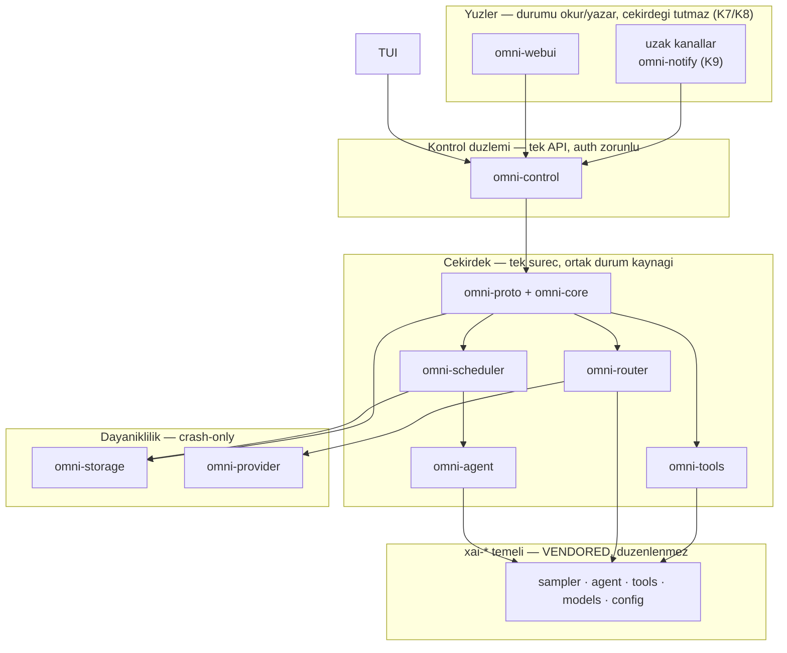

# Omnitrix mimarisi — ozet

> **Bu belge otorite degildir.** Kaynak otorite kokteki
> [`MASTER-PLAN.md`](../MASTER-PLAN.md)'dir; onu doguran kararlar
> [`ALPHA-PLAN.md`](../ALPHA-PLAN.md)'dedir. Burasi yalnizca plandaki katman
> modelinin ve crate haritasinin **gezinilebilir ozetidir**; her bolum plandaki
> ilgili numaraya atif verir. Celiski halinde plan gecerlidir.

## 1. Mimari tez (MASTER-PLAN 1.1)

Omnitrix bir **orkestrasyon katmanidir**. Tek-ajan calisma zamani, LLM tasimasi
ve tool sistemi vendored `xai-*` agacindan gelir; omnitrix bunlarin uzerine
cok-ajan planlama, yonlendirme, persona, saglayici-besleme, uzak erisim ve
dayaniklilik ekler.

Sinir iki yonludur:

- `omni-*` → `xai-*`'a bagimlidir, tersi degil. Her bagimlilik **imza duzeyinde**
  MASTER-PLAN Bolum 2 tablosunda sabittir; tabloda olmayan bir tip/trait/metot
  baglanmaz.
- `xai-*` **duzenlenmez**: `crates/common/` + `crates/codegen/` monorepo'dan
  senkronlanan vendored koddur (surum: kokteki `SOURCE_REV`). Omnitrix onu
  kutuphane gibi tuketir, fork etmez.

Bu, plandaki `I2` invariantidir ve [`bin/ci-gates.sh`](../bin/ci-gates.sh)
tarafindan iki yonlu zorlanir: (a) vendored agacta diff = 0, (b) deklare edilen
her `xai-*` bagimliligi fiilen kullanilir.

## 2. Katman modeli (MASTER-PLAN 1.2)

Plandaki tam diyagram MASTER-PLAN 1.2'dedir. Ozeti:

**Okuma kurallari:**

1. Yuzler **asla** cekirdek durumu tutmaz; kontrol duzleminden okur/yazar.
2. Cekirdek tek surecte yasar; durum mutasyonlari `omni-core` uzerinden tek
   noktadan gecer.
3. Dayaniklilik her yan etkili islemi **once** WAL niyet kaydina yazar (`I7`).
4. `xai-*` en altta, salt-tuketilen temeldir.

## 3. Crate haritasi (MASTER-PLAN 3.1-3.2)

Isim semasi: tek `omnitrix` binary + ic orkestrasyon crate'leri `omni-*`.
`xai-*` isimleri korunur (vendored). Sorumluluk sutunu MASTER-PLAN 3.2
tablosunun ozetidir.

### Ortak durum ve cekirdek

| Crate | Sorumluluk | Plan |
|---|---|---|
| `omni-proto` | Kanonik durum modeli, olay ve komut tipleri — **tek kaynak** | 6.1 |
| `omni-core` | Domain tipleri, ajan/gorev durum makinesi, orkestrasyon cekirdegi | 3.2, 6.2 |
| `omni-config` | Katmanli config: env > DB > dosya | 15 |
| `omni-control` | Tek kontrol duzlemi API'si: auth, SSE/WS yayini, komut girisi | 6.2 |

### Calisma zamani

| Crate | Sorumluluk | Plan |
|---|---|---|
| `omni-scheduler` | `SubagentBackend` implementasyonu; tier gecisleri, kaynak valisi, rekursiyon/fan-out tavanlari, butce kalitimi, interrupt | 7.1-7.5 |
| `omni-router` | Yonlendirme modlari (`round_robin`/`weighted`/`fallback`/`jep`), rol→model cozumu, yanlislamaci yargic + grounding | 10.1-10.3 |
| `omni-tools` | Yetki broker'i, diff-stream fs-shim, kod ogrenme, edit/search kablolamasi | 9.1-9.5 |
| `omni-agent` | `xai_grok_agent::Agent` sarmalayicisi; persona → `AgentDefinition` | 3.2, 11 |

### Dayaniklilik ve saglayicilar

| Crate | Sorumluluk | Plan |
|---|---|---|
| `omni-storage` | CAS, WAL, SQLite/redb, tek-writer aktor, checkpoint | 8.1, 14 |
| `omni-provider` | Saglayici tespiti, keyring, health, anahtar besleme | 12.1-12.3 |
| `omni-backup` | Yedekleme/geri yukleme: 3-2-1, SigV4 imzalama + sifreleme | 17.2 |
| `omni-record` | Oturum kaydi, olay-log, tetiklemeli medya | 17.1 |

### Yuzler ve kanallar

| Crate | Sorumluluk | Plan |
|---|---|---|
| `omni-webui` | Sunucu-render web yuzu (SSR + SSE/WS), JS derleme zinciri yok | 3.2, 6.2 |
| `omni-notify` | Bildirim kanallari, dedup, politika, tetikleyici | 6.6 |
| `omni-research` | Saglayici-degistirilebilir arastirma motoru | 19.2 |

### Kabuk

| Crate | Sorumluluk | Plan |
|---|---|---|
| `omnitrix` | Binary: lazy-init entrypoint + alt-komutlar | 8.2, 20 |
| `omni-tests` | Kapi testi kosum takimi; kokteki `tests/*.rs` hedeflerini barindirir | 4, 20 |
| `omni-bench` | Faz kapisi olcum araci: cold-start, shutdown, RSS | 4, 8.1-8.2 |

**Ayrim kurali (MASTER-PLAN Bolum 4):** `crates/omni/` yazilir ve duzenlenir;
`crates/common/` + `crates/codegen/` salt okunur temeldir.

## 4. Durum akisi (MASTER-PLAN 6.1-6.2)

- **Okuma:** yuz, `omni-control`'den ilk yuklemede bir sistem anlik goruntusu,
  ardindan bir olay akisi (SSE/WS) alir. TUI ve WebUI **ayni** akisi tuketir;
  yalnizca render farklidir.
- **Yazma:** yuz komutlari `omni-control`'e gider, cekirdek uygular, sonuc olay
  olarak **her iki yuze** yayilir. Birinden yapilan degisiklik digerinde gorunur.
- **Tek yazar:** mutasyonlar `omni-core` uzerinden gecer, `omni-storage`
  writer-aktoru WAL'a yazar.

Kapisi: `tests/ui_parity.rs`.

## 5. Ajan yasam dongusu (MASTER-PLAN 7)

Tier modeli "aktif ≠ var-olan" ayrimina dayanir: `Existing` → `Sleeping` →
`Queued` → `Active`. Aktif slot sayisi **sabit degildir**; kaynak valisi
donanim basincina gore dinamik karar verir.

Degismez kural: **calisan bir gorev dusurulmez.** Basinc yukseldiginde en uzun
sure bostaki aktif ajan sikistirilip uykuya alinir ve kuyruk buyur; is
tamamlanana kadar kayitli kalir.

Spawn aninda uc tavan zorlanir: derinlik, seviye basina fan-out, ve kaynak
valisinin dinamik global aktif tavani. Butce ebeveynden cocuga zarf olarak
kalitilir; cocugun harcamasi ebeveynin kalanindan duser.

Bir gorev **ancak** otomatik dogrulama gecerse, yanlislamaci yargic onaylarsa ve
kullanici onaylarsa `Done` olur; o noktada alt ajanlar toplanir ve butce tuketimi
kesilir.

## 6. Dayaniklilik: crash-only (MASTER-PLAN 8)

Normal kapanis ile ani olum **ayni** kod yolundan gecer:

1. Her yan etkili islem, yapilmadan **once** idempotent bir niyet kaydi yazar
   (`write_journal`, `op_id` UNIQUE, `applied=0`) — `I7`.
2. Islem yapilir; basariyla → `applied=1`.
3. Kapanis sinyali → flush yok, bekleme yok. Kapanis **O(1)**, veri hacminden
   bagimsiz.
4. Aciliste `applied=0` niyetler replay edilir; idempotent olduklari icin tekrar
   guvenlidir.

Cold-start tarafinda ilk TUI frame'i hicbir saglayiciya baglanmadan, hicbir ajan
yuklemeden cizilir; isinma frame'den **sonra** arka planda baslar.

Kapilar: `tests/crash_recovery.rs` (veri kaybi yok) ve `omni-bench`
(cold-start / shutdown / RSS esikleri).

## 7. Tool sistemi ve yonlendirme (MASTER-PLAN 9-10)

- **Yetki tek noktada:** her persona bir tool izin listesi tasir; ajanin gordugu
  tool kumesi ona gore filtrelenir. Expose edilmeyen tool, model ne uretirse
  uretsin calismaz. Kabuk komutlari ayrica parse + politika suzgecinden gecer ve
  denetim tablosuna loglanir. Kapisi: `tests/tool_allowlist_redteam.rs`.
- **Diff gorunurlugu:** ajanin tum dosya yazimlari bir FS-shim ile sarilir; kanca
  FS trait duzeyinde oldugu icin calisma dizini ici/disi fark etmez. Oncesi/sonrasi
  CAS'a gider, +/- hunk hesabi olay akisina dusar. Kapisi: `tests/diff_visibility.rs`.
- **Model katalogu:** roller (yargic/yurutucu/planlayici/ozet/web-arama) →
  model cozumu **calisma zamaninda** katalogdan yapilir; kodda literal model adi
  ya da fiyat bulunmaz (`I5`).
- **Grounding:** determinizm ornekleme sicakligindan degil **surec katmanindan**
  gelir — kanit zorunlulugu, ureten ≠ dogrulayan ayrimi, yanlislamaci yargic ve
  ihlal maliyeti. Kapisi: `tests/grounding_redteam.rs`.

## 8. Config (MASTER-PLAN 15)

Uc katman, oncelik yuksekten dusuge: **env (`OMNITRIX_*`) > DB (`config_kv`) >
dosya (`config/*.toml` + aktif profil)**. Yuzden degistirilen calisma-zamani
ayarlari DB katmanina yazilir ve aninda etkili olur; git-izlenen persona/prompt
gibi seyler dosya katmaninda kalir.

## 9. Invariantlar (MASTER-PLAN 1.3)

`I1` kapi = komut + metrik + esik · `I2` tek yonlu `xai-*` bagimliligi ·
`I3` tek ortak durum kaynagi · `I4` yetki tek noktada · `I5` model adi/fiyati
gomulu degil · `I6` uretim yolunda `unwrap`/`expect`/`panic!` = 0 ·
`I7` once WAL niyet kaydi · `I8` her olgusal iddia kanit referansli.

Zorlama noktalari ve kosulacak komutlar icin bkz.
[README — Kapilar](../README.md#kapilar) ve
[`bin/ci-gates.sh`](../bin/ci-gates.sh).
